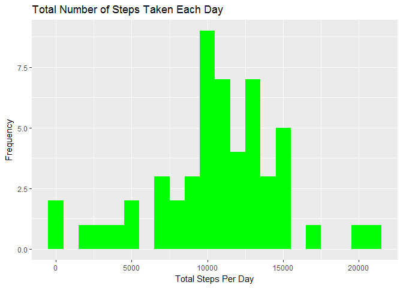
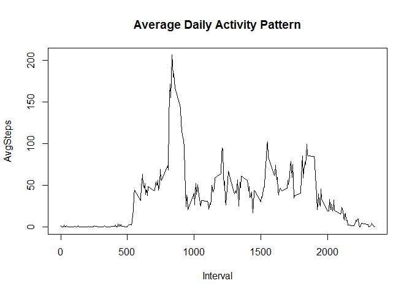
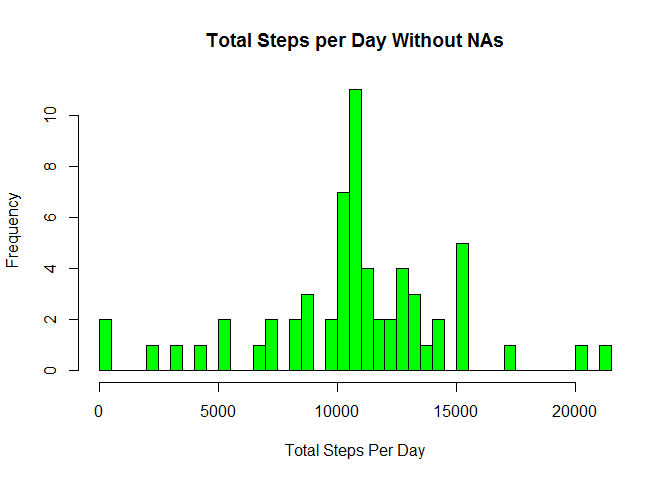
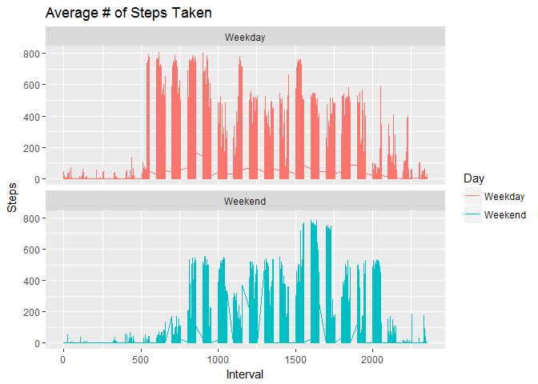

# Reproducible Research: Peer Assessment 1

## 1. Loading and preprocessing the data
### downloaded and unzipped necessary file

```r
 fileUrl <- "https://d396qusza40orc.cloudfront.net/repdata%2Fdata%2Factivity.zip"
 download.file(fileUrl,destfile= "activity.zip")
 unzip("activity.zip")
```

### reading files

```r
activity <- read.csv("Activity.csv")  
activity$date <- as.Date(activity$date, "%Y-%m-%d")  
summary (activity)  
```

```
##      steps             date               interval     
##  Min.   :  0.00   Min.   :2012-10-01   Min.   :   0.0  
##  1st Qu.:  0.00   1st Qu.:2012-10-16   1st Qu.: 588.8  
##  Median :  0.00   Median :2012-10-31   Median :1177.5  
##  Mean   : 37.38   Mean   :2012-10-31   Mean   :1177.5  
##  3rd Qu.: 12.00   3rd Qu.:2012-11-15   3rd Qu.:1766.2  
##  Max.   :806.00   Max.   :2012-11-30   Max.   :2355.0  
##  NA's   :2304
```

### load library

```r
library(ggplot2)
```

```
## Warning: package 'ggplot2' was built under R version 3.3.2
```

```r
library(dplyr)
```

```
## 
## Attaching package: 'dplyr'
```

```
## The following objects are masked from 'package:stats':
## 
##     filter, lag
```

```
## The following objects are masked from 'package:base':
## 
##     intersect, setdiff, setequal, union
```


## 2. What is mean total number of steps taken per day
### sum the data and group by date

```r
activitydailysteps<- aggregate (activity$steps, by=list(activity$date), sum)
names(activitydailysteps) <-c('Date','Steps')
```

### histogram of total steps per day

```r
ggplot(activitydailysteps, aes(x=activitydailysteps$Steps)) + geom_histogram(fill = "green", binwidth = 1000, na.rm=TRUE) + 
labs(title = "Total Number of Steps Taken Each Day", x = "Total Steps Per Day", y = "Frequency")
```

<!-- -->

### calculate the mean and median to the steps

```r
activitydailystepsmean <-mean(activitydailysteps$Steps, na.rm=TRUE)
activitydailystepsmedian <-median(activitydailysteps$Steps, na.rm=TRUE)
```

###### The mean of the total number of steps taken per day is 10766.1886792453.
###### The median of the total number of steps taken per day is 10765.


## 3. What is the average daily activity pattern
### calculate the average steps taken in each 5-minute interval per day

```r
activityremovena<-na.omit(activity)
activitystepsinterval<- aggregate(activityremovena$steps, by=list(activityremovena$interval), mean)
names(activitystepsinterval) <-c('Interval','AvgSteps')
```

### time series plot of average steps for 5-minute intervals

```r
plot(activitystepsinterval, type = "l", main="Average Daily Activity Pattern")
```

<!-- -->

### which 5-minute interval, on average across all the days, contains the maximum number of steps

```r
allmaxsteps <- which.max(activitystepsinterval$AvgSteps)
Avgmaxstep <- activitystepsinterval[allmaxsteps, ]$AvgSteps
Intervalmaxstep <- activitystepsinterval[allmaxsteps,]$Interval
```

###### The 5-minute interval that contains the maximum number of steps is 835.


## 4. imputting missing values

```r
## calculate the total number of missing values in the dataset
missna <- activity
sum(is.na(missna))
```

```
## [1] 2304
```

###### There are 2,304 missing values in the activity dataset.

### fill in missing values and create new dataset

```r
missavgna <-is.na(missna$steps)
missavgint <- tapply(missna$steps, missna$interval, mean, na.rm=TRUE, simiplify = TRUE)
missna$steps[missavgna] <- missavgint[as.character(missna$interval[missavgna])]
sum(is.na(missna))
```

```
## [1] 0
```

###### There are no missing values in the missna dataset.

### histogram of total steps per day

```r
missnaspd <- aggregate(steps ~ date, data = missna, FUN = sum, na.rm = TRUE)
hist(missnaspd$steps, main = "Total Steps per Day Without NAs", xlab = "Total Steps Per Day", ylab = "Frequency", col = "green", breaks = 50)
```

<!-- -->

### calculate the mean and median to the steps

```r
missnamean <-mean(missnaspd$steps, na.rm=TRUE)
missnamedian <-median(missnaspd$steps, na.rm=TRUE)
```

###### The mean of the total number of steps taken per day is 10766.1886792453.
###### The median of the total number of steps taken per day is 10766.188.

### what is the impact of imputting missing data


```r
print (summary(activitydailysteps))  
```

```
##       Date                Steps      
##  Min.   :2012-10-01   Min.   :   41  
##  1st Qu.:2012-10-16   1st Qu.: 8841  
##  Median :2012-10-31   Median :10765  
##  Mean   :2012-10-31   Mean   :10766  
##  3rd Qu.:2012-11-15   3rd Qu.:13294  
##  Max.   :2012-11-30   Max.   :21194  
##                       NA's   :8
```

```r
print (summary(missnaspd))  
```

```
##       date                steps      
##  Min.   :2012-10-01   Min.   :   41  
##  1st Qu.:2012-10-16   1st Qu.: 9819  
##  Median :2012-10-31   Median :10766  
##  Mean   :2012-10-31   Mean   :10766  
##  3rd Qu.:2012-11-15   3rd Qu.:12811  
##  Max.   :2012-11-30   Max.   :21194
```

###### The mean and median are very close, the quantiles are different though.

## 5. differences in activity patterns between weekdays and weekends
### New factor variables for weekday and weekend

```r
missna <- missna%>%   mutate(Day=ifelse(weekdays(missna$date)=="Saturday" | weekdays(missna$date)=="Sunday", "Weekend", "Weekday"))
```

### make a plot containing the time series of the 5-minute interval and the average number of steps taken, averaged across all weekdays or weekend days

```r
missnaplot <- aggregate(steps ~ interval, data = missna, FUN = mean, na.rm = TRUE)
ggplot(missna, aes(x=interval, y=steps, color=Day)) + geom_line() + labs(title = "Average # of Steps Taken", x = "Interval", y = "Steps") + facet_wrap(~ Day, ncol = 1, nrow = 2)
```

<!-- -->

######## *Yes, there are differences in activity patterns between weekdays and weekend.*   
